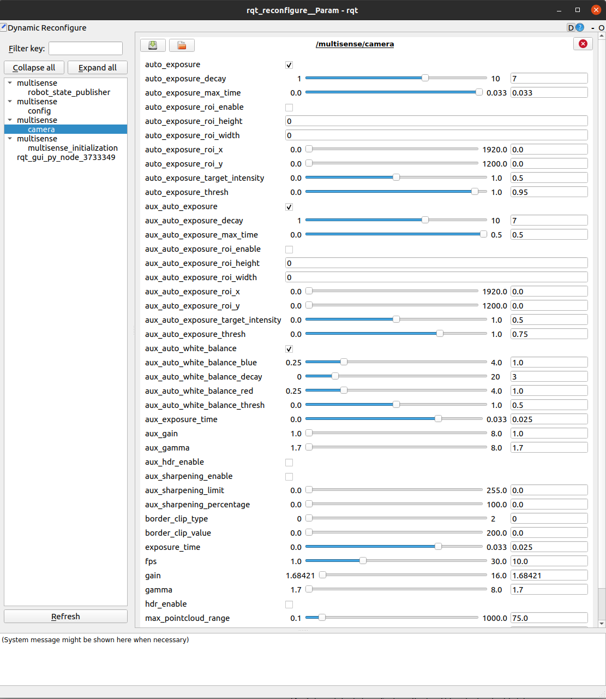

# MultiSense ROS2 Driver

The officially supported MultiSense ROS2 driver

This driver was developed and tested using Jazzy Jalisco. Earlier ROS2 distros are not supported

If you are unable to use ROS2 Jazzy, please build [v1.0.0](https://github.com/carnegierobotics/multisense_ros2/releases/tag/v1.0.0) of
the MultiSense ROS2 driver

## Build

Clone the MultiSense ROS2 driver

```bash
source /opt/ros/<ros2_distro>/setup.bash
mkdir ros2_ws && cd ros2_ws
git clone --recurse-submodules https://github.com/carnegierobotics/multisense_ros2 src
```

Ensure all the MultiSense ROS2 dependencies are installed using rosdep

```bash
sudo rosdep init
rosdep update
rosdep install --from-paths src -y --ignore-src
```

Build and install the ROS2 driver

```bash
colcon build
source install/setup.bash
```

## Launch

```bash
ros2 launch multisense_ros multisense_launch.py
```

For the full set of launch arguments use

```bash
ros2 launch multisense_ros multisense_launch.py -s
```

## Published Topics

The MultiSense ROS2 driver publishes data under several namespaces. By default, the main namespace is `/multisense`. Topics are only published when there are active subscribers to conserve network bandwidth.

### Main Node (`/multisense`)

- `histogram` (`multisense_msgs/msg/Histogram`): A 256-bin histogram of image intensities from the left camera, can be used for auto-exposure calculations or image analysis. This is computed onboard the MultiSense
- `info` (`multisense_msgs/msg/Info`): Static sensor information, including the serial number, hardware version, firmware version, and details about the available optics and imagers. Published as a latched topic.
- `raw_config` (`std_msgs/msg/String`): The raw configuration state from the sensor. Will change as parameters are changed via the ROS2 parameter server. Published as a latched topic.
- `status` (`multisense_msgs/msg/Status`): Periodic diagnostic messages reporting internal temperatures, power consumption, uptime, and other sensor health metrics.
- `points2` (`sensor_msgs/msg/PointCloud2`): A dense 3D point cloud generated from the stereo disparity image. This contains only 3D points, and does not contain any color imformation
- `image_points2` (`sensor_msgs/msg/PointCloud2`): A 3D point cloud that includes a `luminance` (grayscale) intensity channel mapped from the left camera's image.
- `image_points2_color` (`sensor_msgs/msg/PointCloud2`): A 3D point cloud that includes RGB color information, typically mapped from the aux camera (if available) onto the 3D structure.

### Left Camera (`/multisense/left`)

- `image_mono` (`sensor_msgs/msg/Image`): The raw, unrectified monochrome image direct from the left image sensor.
- `image_mono/camera_info` (`sensor_msgs/msg/CameraInfo`): The intrinsic camera calibration parameters and distortion coefficients corresponding to the raw left image.
- `image_rect` (`sensor_msgs/msg/Image`): The rectified monochrome image from the left sensor, corrected for lens distortion and aligned to a common epipolar geometry.
- `image_rect/camera_info` (`sensor_msgs/msg/CameraInfo`): The intrinsic camera calibration parameters and distortion coefficients corresponding to the rectified left image.
- `depth` (`sensor_msgs/msg/Image`): A 32-bit floating-point image where each pixel value represents the estimated depth in meters from the camera's optical center.
- `depth/camera_info` (`sensor_msgs/msg/CameraInfo`): Camera calibration info corresponding to the depth image.
- `openni_depth` (`sensor_msgs/msg/Image`): A 16-bit unsigned integer depth image quantized in millimeters, formatted for compatibility with OpenNI-based applications.
- `openni_depth/camera_info` (`sensor_msgs/msg/CameraInfo`): Camera calibration info corresponding to the OpenNI depth image.
- `disparity` (`sensor_msgs/msg/Image`): A 16-bit disparity image representing the horizontal pixel shift between the left and right rectified images. This is quantized to 1/16th of a pixel
- `disparity/camera_info` (`sensor_msgs/msg/CameraInfo`): Camera calibration info corresponding to the disparity image.
- `cost` (`sensor_msgs/msg/Image`): An image representing the stereo matching cost (confidence or error metric) for each pixel from the onboard stereo matching algorithm.
- `cost/camera_info` (`sensor_msgs/msg/CameraInfo`): Camera calibration info corresponding to the cost image.
- `disparity_image` (`stereo_msgs/msg/DisparityImage`): A standard ROS disparity image message containing the disparity data along with focal length, baseline, and min/max disparity values needed for 3D reconstruction.

### Right Camera (`/multisense/right`)

- `image_mono` (`sensor_msgs/msg/Image`): The raw, unrectified monochrome image direct from the right image sensor.
- `image_mono/camera_info` (`sensor_msgs/msg/CameraInfo`): The intrinsic camera calibration parameters and distortion coefficients corresponding to the raw right image.
- `image_rect` (`sensor_msgs/msg/Image`): The rectified monochrome image from the right sensor, corrected for lens distortion and aligned to a common epipolar geometry with the left camera.
- `image_rect/camera_info` (`sensor_msgs/msg/CameraInfo`): The intrinsic camera calibration parameters and distortion coefficients corresponding to the rectified right image.

### Aux Camera (`/multisense/aux`) - If Available

The auxiliary camera (typically a high-resolution RGB sensor) is available on specific models like the S27, S30, and KS21.

- `image_mono` (`sensor_msgs/msg/Image`): The raw, unrectified monochrome (luma) image from the auxiliary sensor.
- `image_mono/camera_info` (`sensor_msgs/msg/CameraInfo`): Camera calibration info for the raw aux luma image.
- `image_color` (`sensor_msgs/msg/Image`): The raw, unrectified RGB color image from the auxiliary sensor.
- `image_color/camera_info` (`sensor_msgs/msg/CameraInfo`): Camera calibration info for the raw aux color image.
- `image_rect` (`sensor_msgs/msg/Image`): The rectified monochrome (luma) image from the auxiliary sensor, corrected for lens distortion.
- `image_rect/camera_info` (`sensor_msgs/msg/CameraInfo`): Camera calibration info for the rectified aux luma image.
- `image_rect_color` (`sensor_msgs/msg/Image`): The rectified BGR color image from the auxiliary sensor, corrected for lens distortion.
- `image_rect_color/camera_info` (`sensor_msgs/msg/CameraInfo`): Camera calibration info for the rectified aux color image.
- `depth` (`sensor_msgs/msg/Image`): The 32-bit floating-point depth image specifically projected and aligned to the viewpoint of the auxiliary camera.
- `depth/camera_info` (`sensor_msgs/msg/CameraInfo`): Camera calibration info corresponding to the aux-aligned depth image.
- `openni_depth` (`sensor_msgs/msg/Image`): The 16-bit unsigned integer depth image quantized in millimeteres specifically projected and aligned to the viewpoint of the auxiliary camera.
- `openni_depth/camera_info` (`sensor_msgs/msg/CameraInfo`): Camera calibration info corresponding to the aux-aligned OpenNI depth image.

### IMU (`/multisense/imu`) - If Available

- `imu_data` (`sensor_msgs/msg/Imu`): High-rate inertial measurement data containing 3-axis linear acceleration and 3-axis angular velocity from the sensor's internal IMU.

## Published TF Frames

The MultiSense ROS2 driver publishes a static TF tree based on the factory calibration of the device. These transforms establish the exact optical relationships between the camera sensors. The default TF prefix is the `namespace` of the node (default: `multisense`).

The optical coordinate frame convention used is: X right, Y down, Z forward.

The root of the optical TF tree published by the driver is the rectified left camera frame. The following static transforms are published:

- `/<namespace>/left_camera_optical_frame` $\rightarrow$ `/<namespace>/left_camera_frame` (unrectified left image frame)
- `/<namespace>/left_camera_optical_frame` $\rightarrow$ `/<namespace>/right_camera_optical_frame` (rectified right image frame)
- `/<namespace>/right_camera_optical_frame` $\rightarrow$ `/<namespace>/right_camera_frame` (unrectified right image frame)

If an auxiliary camera is present, the following transforms are also published:

- `/<namespace>/left_camera_optical_frame` $\rightarrow$ `/<namespace>/aux_camera_optical_frame` (rectified aux image frame)
- `/<namespace>/aux_camera_optical_frame` $\rightarrow$ `/<namespace>/aux_camera_frame` (unrectified aux image frame)

*Note:* When `launch_robot_state_publisher` is enabled in the launch file (which is the default), a `robot_state_publisher` node is also launched with the appropriate URDF for your MultiSense model. The URDF provides the physical device links (e.g., `base_link`, physical mounting points, and the `imu_frame`) and connects them to the optical TF tree. Please be aware that the link transformations defined within the URDF are approximate (based on nominal CAD models) and are not factory calibrated.

## Configuration

MultiSense operation parameters including resolution, frame rate, gain, exposure gamma, etc. can be dynamically changed
at runtime via the [ROS2 parameter server](https://docs.ros.org/en/jazzy/Tutorials/Beginner-CLI-Tools/Understanding-ROS2-Parameters/Understanding-ROS2-Parameters.html).

For convince the MultiSense ROS2 driver uses the ROS2 [generate_parameter_library](https://github.com/PickNikRobotics/generate_parameter_library) for managing the
majority of it's parameters

### GUI

The rqt_reconfigure GUI can be used to dynamically change camera parameters during camera operation

The following command launches the rqt_reconfigure GUI

```bash
ros2 run rqt_reconfigure rqt_reconfigure
```



NOTE: You may need to click "Refresh" on the bottom left of the rqt_reconfigure panel to see the MultiSense
configuration settings

### Command Line

The [ROS2 parameter server](https://docs.ros.org/en/jazzy/Tutorials/Beginner-CLI-Tools/Understanding-ROS2-Parameters/Understanding-ROS2-Parameters.html)
has a command line interface to dynamically set MultiSense camera parameters at runtime.

The following command gets a full list of ROS2 parameters which can reconfigure the MultiSense at runtime

```bash
ros2 param list
```

#### Parameter Examples

##### Change Framerate

To get the current framerate execute the following command

```bash
ros2 param get /multisense/sensor fps
```

To set the framerate to new value (in this example 15fps) execute the following command

```bash
ros2 param set /multisense/sensor fps 15
```

##### Change Resolution

To get the current operating resolution execute the following command

```bash
ros2 param get /multisense/sensor sensor_resolution
```

To set the sensor resolution to new value (in this example 1/4 resolution with 256 disparities) execute the following command

```bash
ros2 param set /multisense/sensor sensor_resolution "[960, 600, 256]"
```

##### Disable Auto-Exposure for the Main Stereo Pair

To get the current auto exposure execute the following command

```bash
ros2 param get /multisense/sensor image.auto_exposure_enabled
```

To enable/disable the camera's auto exposure algorithm (in this example disable) execute the following command

```bash
ros2 param set /multisense/sensor image.auto_exposure_enabled false
```

##### Disable Auto-Exposure for the Aux Imager (Only supported on S27, S30, and KS21 cameras)

To get the current auto exposure execute the following command

```bash
ros2 param get /multisense/sensor aux.image.auto_exposure_enabled
```

To enable/disable the aux camera's auto exposure algorithm (in this example disable) execute the following command

```bash
ros2 param set /multisense/sensor aux.image.auto_exposure_enabled false
```

#### Set parameters during launch

The recommended way to configure parameters when launching ROS2 drivers is via [YAML parameter configuration files](https://docs.ros.org/en/jazzy/Tutorials/Intermediate/Launch/Using-ROS2-Launch-For-Large-Projects.html#setting-parameters-in-the-launch-file).

Save the following content to a YAML file and pass it to `ros2 launch` to set IMU parameters at startup:

```yaml
multisense:
  sensor:
    ros__parameters:
      imu.accelerometer.rate: 3
      imu.accelerometer.range: 1
      imu.gyroscope.rate: 2
      imu.gyroscope.range: 0
```

You can use:

```bash
ros2 param dump <node name>
ros2 param dump /multisense/config
```

to retrieve the full set of parameters and their current values from each node. The resulting YAML files can be reused as a parameter file when launching the ROS2 driver.

The `params_file` argument to the launch file loads the configured parameters and overrides each parameter’s default value with the values specified in the YAML file:

```bash
ros2 launch multisense_ros multisense_launch.py params_file:=<path-to-yaml-file>
```

## Time Synchronization

The MultiSense ROS2 driver supports the following three types of time synchronization.

- PTP time synchronization: If the camera has been properly configured to synchronize its time with a remote PTP grandmaster, enabling the
`time.ptp_enabled` parameter will stamp all sensor data with the PTP synchronized time. Enabling the `time.ptp_enabled` parameter will override
all other time synchronization methods.
- Network time synchronization: For local testing where microsecond level synchronization is not critical, network time synchronization can be
used to update sensor data timestamps to match the host system time. This uses a simple request-response scheme to query the MultiSense system
time, and estimate the network latency between sending the request and receiving the response message. The adjusted offset is smoothed, and applied
to all published sensor data from the MultiSense ROS2 driver. Network time sync can be enabled using the `time.network_time_sync_enabled`, and is the
default time synchronization mode for the MultiSense driver
- Camera time: Sensor data is published using the raw MultiSense system time. This time source starts at 0 when the camera is powered on.
This mode is enabled when the parameters `time.ptp_enabled` and `time.network_time_sync_enabled` are both set to false
