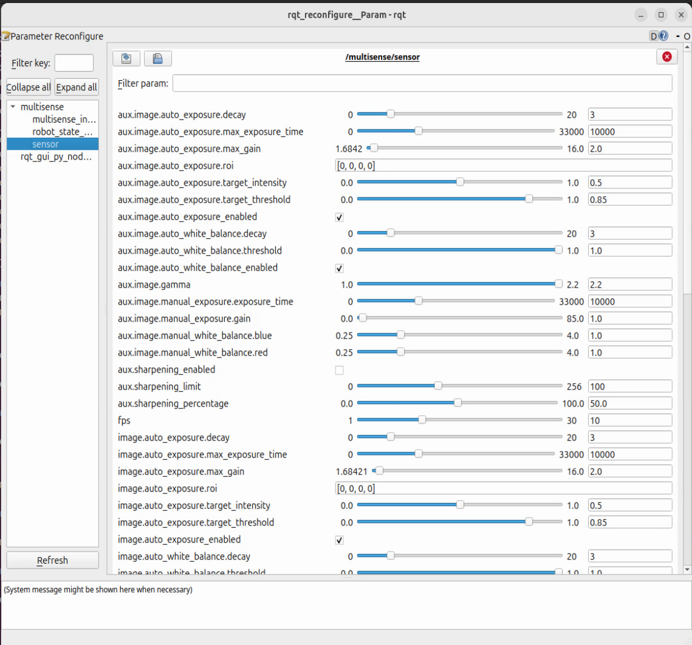

# MultiSense ROS2 Driver

The officially supported MultiSense ROS2 driver

This driver was developed and tested using Jazzy Jalisco. Earlier ROS2 distros are not supported

If you are unable to use ROS2 Jazzy, please build [v1.0.0](https://github.com/carnegierobotics/multisense_ros2/releases/tag/v1.0.0) of
the MultiSense ROS2 driver

## Build

Clone the MultiSense ROS2 driver

```
source /opt/ros/<ros2_distro>/setup.bash
mkdir ros2_ws && cd ros2_ws
git clone --recurse-submodules https://github.com/carnegierobotics/multisense_ros2 src
```

Ensure all the MultiSense ROS2 dependencies are installed using rosdep

```
sudo rosdep init
rosdep update
rosdep install --from-paths src -y --ignore-src
```

Build and install the ROS2 driver

```
colcon build
source install/setup.bash
```

## Launch

`ros2 launch multisense_ros multisense_launch.py`

For the full set of launch arguments use

`ros2 launch multisense_ros multisense_launch.py -s`

## Configuration

MultiSense operation parameters including resolution, frame rate, gain, exposure gamma, etc. can be dynamically changed
at runtime via the [ROS2 parameter server](https://docs.ros.org/en/jazzy/Tutorials/Beginner-CLI-Tools/Understanding-ROS2-Parameters/Understanding-ROS2-Parameters.html).

For convince the MultiSense ROS2 driver uses the ROS2 [generate_parameter_library](https://github.com/PickNikRobotics/generate_parameter_library) for managing the
majority of it's parameters

### GUI

The rqt_reconfigure GUI can be used to dynamically change camera parameters during camera operation

The following command launches the rqt_reconfigure GUI

```
ros2 run rqt_reconfigure rqt_reconfigure
```



NOTE: You may need to click "Refresh" on the bottom left of the rqt_reconfigure panel to see the MultiSense
configuration settings

### Command Line

The [ROS2 parameter server](https://docs.ros.org/en/jazzy/Tutorials/Beginner-CLI-Tools/Understanding-ROS2-Parameters/Understanding-ROS2-Parameters.html)
has a command line interface to dynamically set MultiSense camera parameters at runtime.

The following command gets a full list of ROS2 parameters which can reconfigure the MultiSense at runtime

```
ros2 param list
```

#### Parameter Examples

##### Change Framerate

To get the current framerate execute the following command

```
ros2 param get /multisense/sensor fps
```

To set the framerate to new value (in this example 15fps) execute the following command

```
ros2 param set /multisense/sensor fps 15
```

##### Change Resolution

To get the current operating resolution execute the following command

```
ros2 param get /multisense/sensor sensor_resolution
```

To set the sensor resolution to new value (in this example 1/4 resolution with 256 disparities) execute the following command

```
ros2 param set /multisense/sensor sensor_resolution "[960, 600, 256]"
```

##### Disable Auto-Exposure for the Main Stereo Pair

To get the current auto exposure execute the following command

```
ros2 param get /multisense/sensor image.auto_exposure_enabled
```

To enable/disable the camera's auto exposure algorithm (in this example disable) execute the following command

```
ros2 param set /multisense/sensor image.auto_exposure_enabled false
```

##### Disable Auto-Exposure for the Aux Imager (Only supported on S27, S30, and KS21 cameras)

To get the current auto exposure execute the following command

```
ros2 param get /multisense/sensor aux.image.auto_exposure_enabled
```

To enable/disable the aux camera's auto exposure algorithm (in this example disable) execute the following command

```
ros2 param set /multisense/sensor aux.image.auto_exposure_enabled false
```

## Time Synchronization

The MultiSense ROS2 driver supports the following three types of time synchronization.

- PTP time synchronization: If the camera has been properly configured to synchronize its time with a remote PTP grandmaster, enabling the
`time.ptp_enabled` parameter will stamp all sensor data with the PTP synchronized time. Enabling the `time.ptp_enabled` parameter will override
all other time synchronization methods.
- Network time synchronization: For local testing where microsecond level synchronization is not critical, network time synchronization can be
used to update sensor data timestamps to match the host system time. This uses a simple request-response scheme to query the MultiSense system
time, and estimate the network latency between sending the request and receiving the response message. The adjusted offset is smoothed, and applied
to all published sensor data from the MultiSense ROS2 driver. Network time sync can be enabled using the `time.network_time_sync_enabled`, and is the
default time synchronization mode for the MultiSense driver
- Camera time: Sensor data is published using the raw MultiSense system time. This time source starts at 0 when the camera is powered on.
This mode is enabled when the parameters `time.ptp_enabled` and `time.network_time_sync_enabled` are both set to false
